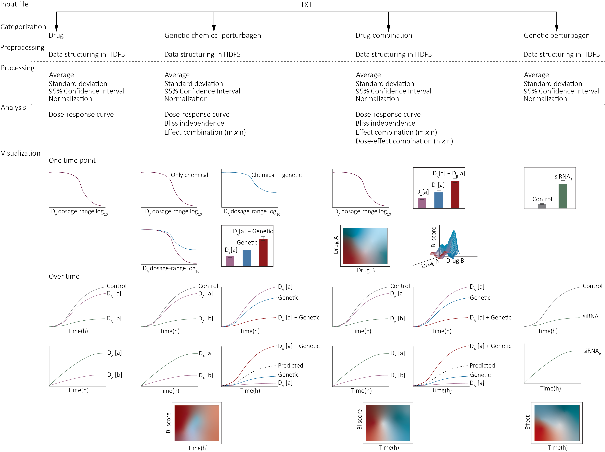

# HTSplotter
An end-to-end data processing, analysis and visualisation tool for chemical and genetic in vitro perturbation screens

website [manual](HTSplotter/web/images/HTSplotterManual.pdf).

## HTSplotter running on python:

```
#Install
pip install HTSplotter==0.8

#Uninstall
pip uninstall HTSplotter==0.8

```

#### HTSplotter tutorial- running from python


```
import HTSplotter as HTSP

# make HTSplotter object
hts = HTSP.HTSplotter()

# set main folder path
hts.main_folder = 'analyses_folder/'

# set input files path
input_path = 'analyses_folder/inputfiles/'

# set path for extracted information from the headers
information_extracted = 'analyses_folder/information_extracted_files/'

# set path for extracted information from the headers
self.results_path = 'analyses_folder/outputfiles/'

# set 0 if it is not a biological replicate analysis or 1 if it is
self.biological_replicate = 0

# set 0 if user input is aimed, set 1 if not
self.userinput = 0

# set readout information
self.information_readout = 'confluency'

# set readout units
self.readout_units = '(%)'

# expected effect, if inhibition, 0, if enhancement, 1
self.expected_effect = 0

# in case of biological replicate analysis give a file name. If it is not a biological replicate analysis set 0
self.file_name_br = 0

# list of file names
self.files_list = ['drugscreen_1timepoint.txt', 'drug_combination_screen_1timepoint']

# execute analysis
htsplotter.execute()

```
### HTSplotter tutorial- running from file

#### preper input_file
HTSplotter allows an input file, as txt, with all atributes and files. In this way, all files to be analysed with the same atributes can be grouped in one block
chekc [input file](input_file.txt) example
```
import HTSplotter as HTSP

# input file with different atributes and different files
hts.execute_from_file('PATH_from_your_input_file/input_file.txt')

# execute analysis
htsplotter.execute()

```
# HTSplotter scheme

